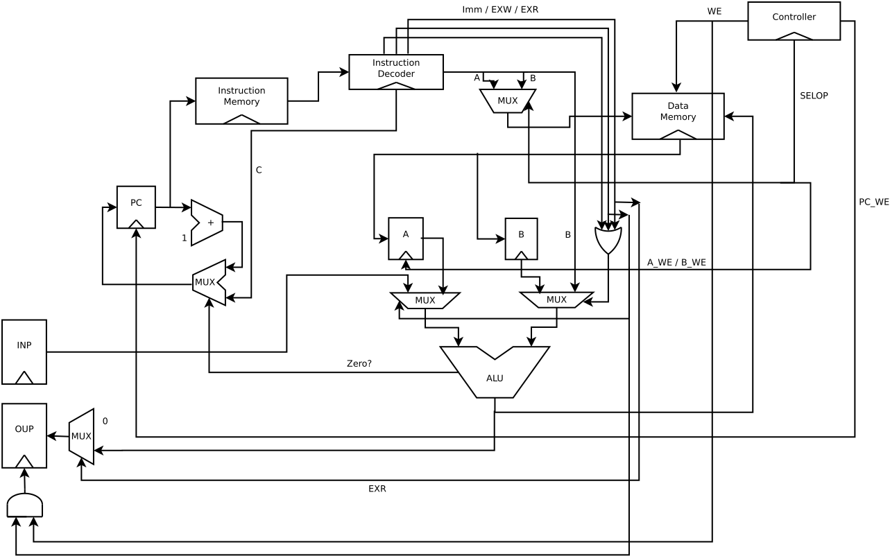

# SUBLEQ:

A small CPU build in 24 hours.

## Instruction set:

The processor supports only a single instruction (which is Turing complete).

> SUBLEQ A B C
>
> Semantics:
> MEM[A] = MEM[A] - MEM[B] if result <= 0 then jump to C

It also supports a few variants of the aformentioned instruction:

> SUBLEQ.IMM A B C
>
> Semantics:
> MEM[A] = MEM[A] - B if result <= 0 then jump to C

> SUBLEQ.EXR A B C
>
> Semantics:
> MEM[A] = INP - B if result <= 0 then jump to C

> SUBLEQ.EXW A B C
>
> Semantics:
> OUP = MEM[A] - B if result <= 0 then jump to C

## Architecture

